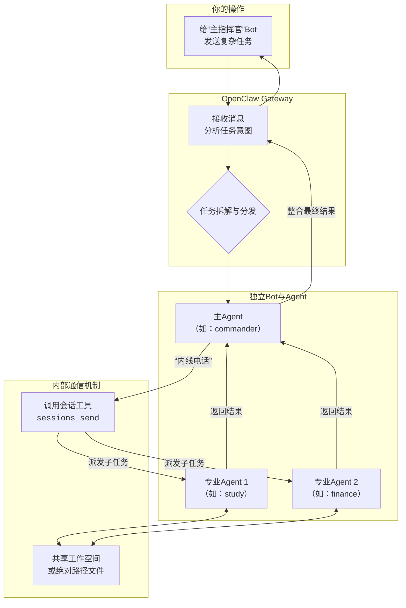

在“独立团”模式下，让多个拥有独立Bot账号的Agent相互沟通，本质上是通过**Gateway（网关）统一调度**，并赋予特定Agent（通常是主Agent）**跨会话的“内线电话”权限**来实现的。

整个过程可以分解为三个核心步骤：**建立独立入口**、**指派指挥官**、**开启协作权限**。下面我将结合具体的配置代码，为你详细拆解。

### 🗺️ “独立团”沟通模式总览

下图清晰地展示了在这种模式下，消息是如何流动和协作的：



简单来说，你只和“主指挥官”Bot对话，它在后台通过内部工具调度其他“专家”Bot并行工作，最后将整合好的结果汇报给你。

### 🛠️ 核心配置三步走

以下是实现上述流程所需的关键配置，你可以参照这些代码块进行设置。

#### **步骤1：建立独立入口**

首先，你需要为每个Agent创建独立的Telegram Bot，并在OpenClaw的配置文件 (`~/.openclaw/openclaw.json`) 中，将这些Bot Token与对应的Agent进行绑定，并为它们分配独立的“工作区” (`workspace`)。

```json
{
  "agents": {
    "list": [
      {
        "id": "commander", // 主指挥官Agent ID
        "name": "中央指挥官",
        "workspace": "~/.openclaw/workspace-commander" // 独立工作区
      },
      {
        "id": "study",    // 学习助手Agent ID
        "name": "学习训练Agent",
        "workspace": "~/.openclaw/workspace-study"
      },
      {
        "id": "finance",  // 理财助手Agent ID
        "name": "理财Agent",
        "workspace": "~/.openclaw/workspace-finance"
      }
    ]
  },
  "channels": {
    "telegram": {
      "accounts": { // 配置多个Bot账号
        "default": { "enabled": true, "botToken": "主指挥官BOT_TOKEN" },
        "study": { "enabled": true, "botToken": "学习助手BOT_TOKEN" },
        "finance": { "enabled": true, "botToken": "理财助手BOT_TOKEN" }
      }
    }
  },
  "bindings": [ // 将Bot与Agent一一绑定
    { "agentId": "commander", "match": { "channel": "telegram", "accountId": "default" } },
    { "agentId": "study", "match": { "channel": "telegram", "accountId": "study" } },
    { "agentId": "finance", "match": { "channel": "telegram", "accountId": "finance" } }
  ]
}
```

完成这一步，你就拥有了多个可以独立私聊的AI助手。

#### **步骤2：指派“指挥官”并授权**

为了让`commander`能够调动其他Agent，需要在它的配置项下，通过`subagents.allowAgents`明确指定它可以调度哪些“部下”。

```json
{
  "agents": {
    "list": [
      {
        "id": "commander",
        "name": "中央指挥官",
        "subagents": {
          "allowAgents": ["study", "finance"] // 明确允许调度的Agent ID列表
        }
      },
      // ... 其他Agent配置
    ]
  }
}
```

#### **步骤3：开启全局协作权限（最关键！）**

这是最容易踩坑的地方，也是最关键的一步。为了让Agent们能“看见”彼此并发送消息，必须开启以下两个全局配置。

```json
{
  // ... 其他配置
  "tools": {
    "sessions": {
      "visibility": "all" // 必须设置为all，允许Agent查看彼此会话
    },
    "agentToAgent": {
      "enabled": true,    // 开启Agent间通信
      "allow": ["commander", "study", "finance"], // 允许通信的Agent白名单
    }
  }
}
```

**注意**：`tools.sessions.visibility` 必须设置为 `"all"`，否则Agent之间无法互相发送消息。

### ⚠️ 避坑指南与实战技巧

在配置和运行过程中，有几个常见的“坑”需要特别留意：

-   **🔊 通信不是群聊**：主Agent通过 `sessions_send` 工具给其他Agent派发任务，这是一种**后台通信**。你**不会**看到所有Agent在一个群里“七嘴八舌”地讨论，你只会收到主Agent最终整合好的结果。其他Agent的中间交流过程会记录在各自的会话里，但不会推送到你的聊天界面。
    
-   **📁 文件共享用绝对路径**：如果Agent之间需要传递文件（如研究员写大纲，写手写文章），在提示词中务必使用**绝对路径**（如 `~/.openclaw/shared/outline.md`）。相对路径会导致不同Agent在自己的工作区里找文件，造成文件“失踪”。
    
-   **🎯 权限控制要精确**：如果你想限制某个Agent的权限（例如，禁止主Agent执行代码），应该在**该Agent的单独配置项**里设置 `tools.allow` 和 `tools.deny`，而不要在配置文件最外层的全局 `tools` 中设置 `deny`，否则会“误伤”所有Agent。