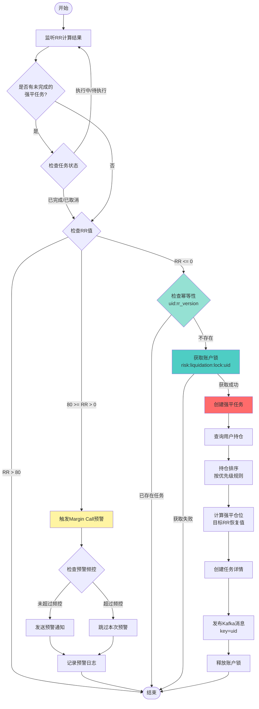
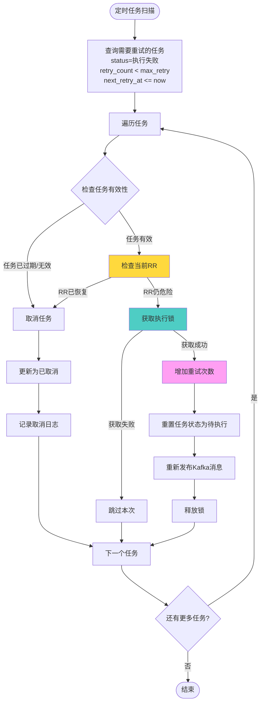
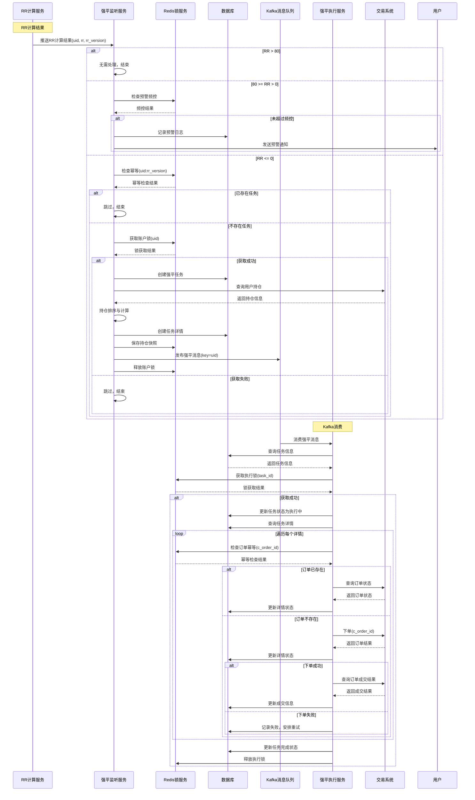
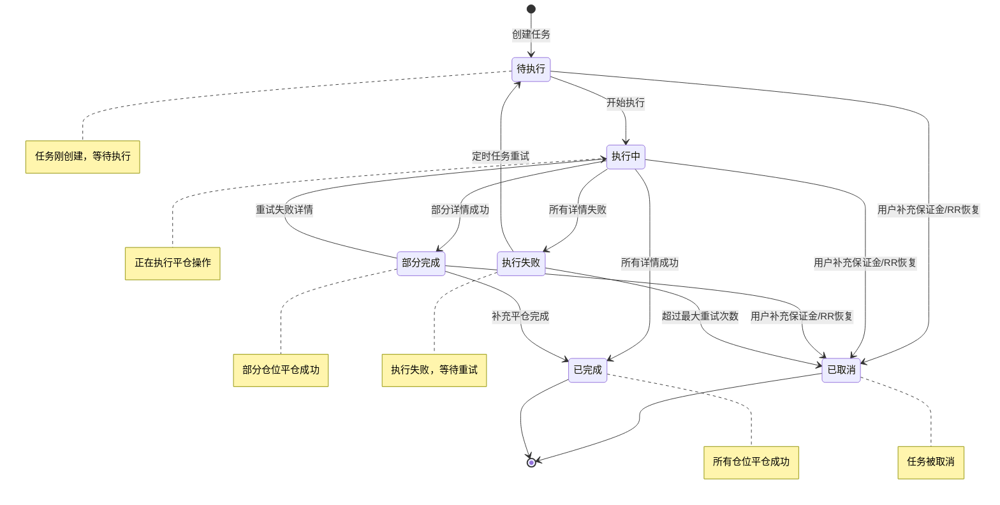
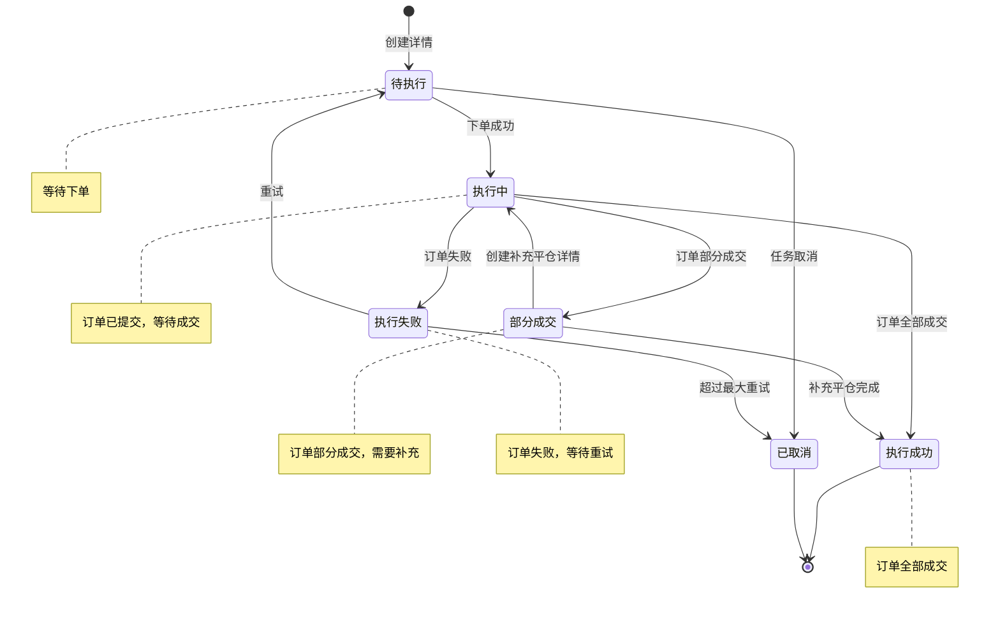

# 券商风险服务 - 强平模块设计方案

## 一、概述

### 1.1 业务背景

强平模块是券商风险服务的核心模块，用于在用户风险率（RR）达到危险阈值时，自动执行强制平仓操作，以保护券商和用户的资金安全。

### 1.2 核心指标

**风险率（RR）计算公式：**

```text
RR = (ELV - EL) / ELV

其中：
- NLV = Cash - Loan + Position (净清算价值)
- ELV = NLV - OMV (含借权益价值，OMV为期权市值)
- EL = ELV - MM + Credit (剩余流动性，MM为维持保证金，Credit为额外信用额度)
```

**触发条件：**

-   RR <= 80：触发 margin call 预警
    
-   RR <= 0：触发强制平仓
    

### 1.3 设计目标

1.  **幂等性**：确保同一强平任务不会重复执行
    
2.  **可检测性**：能够实时查询任务状态和执行结果
    
3.  **可恢复性**：任务失败后能够自动或手动恢复执行
    
4.  **数据一致性**：处理用户手动平仓、补充保证金等并发场景
    
5.  **高可用性**：支持分布式部署，避免单点故障
    

---

## 二、数据库设计

### 2.1 强平任务表 (risk\_force\_sell\_task)

```sql
CREATE TABLE `risk_force_sell_task` (
  `id` bigint(20) unsigned NOT NULL AUTO_INCREMENT COMMENT '主键ID',
  `uid` bigint(20) NOT NULL COMMENT '用户ID',
  `customer_id` bigint(20) NOT NULL COMMENT '客户ID',
  `task_id` char(32) NOT NULL COMMENT '任务ID，全局唯一',
  `status` tinyint(4) NOT NULL DEFAULT '1' COMMENT '任务状态：1-待执行 2-执行中 3-部分完成 4-已完成 5-已取消 6-执行失败',
  `rr` decimal(10,4) NOT NULL COMMENT '触发时的风险率',
  `rr_version` bigint(20) NOT NULL COMMENT 'RR计算结果版本号，用于幂等控制',
  `target_rr` decimal(10,4) DEFAULT NULL COMMENT '目标风险率，平仓后应达到的风险率',
  `total_position_value` decimal(20,4) DEFAULT NULL COMMENT '需要平仓的总仓位价值',
  `executed_position_value` decimal(20,4) DEFAULT '0.0000' COMMENT '已执行的平仓价值',
  `retry_count` int(11) NOT NULL DEFAULT '0' COMMENT '重试次数',
  `max_retry` int(11) NOT NULL DEFAULT '3' COMMENT '最大重试次数',
  `next_retry_at` datetime DEFAULT NULL COMMENT '下次重试时间',
  `started_at` datetime DEFAULT NULL COMMENT '开始执行时间',
  `completed_at` datetime DEFAULT NULL COMMENT '完成时间',
  `cancelled_at` datetime DEFAULT NULL COMMENT '取消时间',
  `cancel_reason` varchar(500) DEFAULT NULL COMMENT '取消原因',
  `extra` json DEFAULT NULL COMMENT '扩展信息，JSON格式',
  `created_at` datetime NOT NULL DEFAULT CURRENT_TIMESTAMP COMMENT '创建时间',
  `updated_at` datetime NOT NULL DEFAULT CURRENT_TIMESTAMP ON UPDATE CURRENT_TIMESTAMP COMMENT '更新时间',
  PRIMARY KEY (`id`),
  UNIQUE KEY `uk_task_id` (`task_id`),
  UNIQUE KEY `uk_uid_rr_version` (`uid`,`rr_version`),
  KEY `idx_uid_status` (`uid`,`status`),
  KEY `idx_status_retry` (`status`,`next_retry_at`),
  KEY `idx_created_at` (`created_at`)
) ENGINE=InnoDB DEFAULT CHARSET=utf8mb4 COMMENT='强平任务表';
```

### 2.2 强平任务详情表 (risk\_force\_sell\_task\_detail)

```sql
CREATE TABLE `risk_force_sell_task_detail` (
  `id` bigint(20) unsigned NOT NULL AUTO_INCREMENT COMMENT '主键ID',
  `task_id` char(32) NOT NULL COMMENT '任务ID',
  `uid` bigint(20) NOT NULL COMMENT '用户ID',
  `customer_id` bigint(20) NOT NULL COMMENT '客户ID',
  `symbol` varchar(50) NOT NULL COMMENT '交易标的代码',
  `price_type` tinyint(4) NOT NULL COMMENT '价格类型：1-市价 2-限价',
  `limit_price` decimal(20,4) DEFAULT NULL COMMENT '限价价格（限价单时使用）',
  `direction` tinyint(4) NOT NULL COMMENT '交易方向：1-买入 2-卖出',
  `side` tinyint(4) NOT NULL COMMENT '仓位方向：1-多仓(long) 2-空仓(short)',
  `target_quantity` decimal(20,8) NOT NULL COMMENT '目标平仓数量',
  `executed_quantity` decimal(20,8) NOT NULL DEFAULT '0.00000000' COMMENT '已执行数量',
  `trade_price` decimal(20,4) DEFAULT NULL COMMENT '成交价格',
  `status` tinyint(4) NOT NULL DEFAULT '1' COMMENT '状态：1-待执行 2-执行中 3-执行成功 4-执行失败 5-已取消 6-部分成交',
  `retry_count` int(11) NOT NULL DEFAULT '0' COMMENT '重试次数',
  `order_id` varchar(64) DEFAULT NULL COMMENT '订单ID（交易系统返回）',
  `c_order_id` varchar(64) NOT NULL COMMENT '自定义订单ID，用于幂等控制',
  `executed_at` datetime DEFAULT NULL COMMENT '执行时间',
  `reason` varchar(500) DEFAULT NULL COMMENT '失败或取消原因',
  `extra` json DEFAULT NULL COMMENT '扩展信息，JSON格式',
  `created_at` datetime NOT NULL DEFAULT CURRENT_TIMESTAMP COMMENT '创建时间',
  `updated_at` datetime NOT NULL DEFAULT CURRENT_TIMESTAMP ON UPDATE CURRENT_TIMESTAMP COMMENT '更新时间',
  PRIMARY KEY (`id`),
  UNIQUE KEY `uk_c_order_id` (`c_order_id`),
  KEY `idx_task_id` (`task_id`),
  KEY `idx_uid_symbol` (`uid`,`symbol`),
  KEY `idx_status` (`status`),
  KEY `idx_order_id` (`order_id`)
) ENGINE=InnoDB DEFAULT CHARSET=utf8mb4 COMMENT='强平任务详情表';
```

### 2.3 强平任务执行日志表 (risk\_force\_sell\_task\_log)

```sql
CREATE TABLE `risk_force_sell_task_log` (
  `id` bigint(20) unsigned NOT NULL AUTO_INCREMENT COMMENT '主键ID',
  `task_id` char(32) NOT NULL COMMENT '任务ID',
  `detail_id` bigint(20) DEFAULT NULL COMMENT '任务详情ID',
  `action` varchar(50) NOT NULL COMMENT '操作类型：CREATE, EXECUTE, RETRY, CANCEL, COMPLETE, FAIL',
  `old_status` tinyint(4) DEFAULT NULL COMMENT '原状态',
  `new_status` tinyint(4) DEFAULT NULL COMMENT '新状态',
  `message` varchar(1000) DEFAULT NULL COMMENT '日志消息',
  `operator` varchar(50) DEFAULT NULL COMMENT '操作人：SYSTEM, ADMIN, USER',
  `extra` json DEFAULT NULL COMMENT '扩展信息，JSON格式',
  `created_at` datetime NOT NULL DEFAULT CURRENT_TIMESTAMP COMMENT '创建时间',
  PRIMARY KEY (`id`),
  KEY `idx_task_id` (`task_id`),
  KEY `idx_detail_id` (`detail_id`),
  KEY `idx_created_at` (`created_at`)
) ENGINE=InnoDB DEFAULT CHARSET=utf8mb4 COMMENT='强平任务执行日志表';
```

### 2.4 Margin Call 预警记录表 (risk\_margin\_call\_warning)

```sql
CREATE TABLE `risk_margin_call_warning` (
  `id` bigint(20) unsigned NOT NULL AUTO_INCREMENT COMMENT '主键ID',
  `uid` bigint(20) NOT NULL COMMENT '用户ID',
  `customer_id` bigint(20) NOT NULL COMMENT '客户ID',
  `rr` decimal(10,4) NOT NULL COMMENT '风险率',
  `rr_version` bigint(20) NOT NULL COMMENT 'RR计算结果版本号',
  `warning_type` tinyint(4) NOT NULL COMMENT '预警类型：1-首次预警 2-重复预警',
  `notification_status` tinyint(4) NOT NULL DEFAULT '0' COMMENT '通知状态：0-未通知 1-已通知',
  `notification_at` datetime DEFAULT NULL COMMENT '通知时间',
  `extra` json DEFAULT NULL COMMENT '扩展信息，JSON格式',
  `created_at` datetime NOT NULL DEFAULT CURRENT_TIMESTAMP COMMENT '创建时间',
  PRIMARY KEY (`id`),
  KEY `idx_uid_rr_version` (`uid`,`rr_version`),
  KEY `idx_created_at` (`created_at`)
) ENGINE=InnoDB DEFAULT CHARSET=utf8mb4 COMMENT='Margin Call预警记录表';
```

---

## 三、缓存设计

### 3.1 Redis 键值设计

#### 3.1.1 账户级分布式锁

```text
Key: risk:liquidation:lock:{uid}
Value: {task_id}
TTL: 30s
说明: 防止同一账户并发执行多个强平任务
```

#### 3.1.2 任务执行锁

```text
Key: risk:liquidation:exec:lock:{task_id}
Value: {worker_id}:{timestamp}
TTL: 60s
说明: 防止同一任务被多个worker重复执行
```

#### 3.1.3 幂等控制

```text
Key: risk:liquidation:idempotent:{uid}:{rr_version}
Value: {task_id}
TTL: 3600s (1小时)
说明: 基于RR版本号的幂等控制，防止同一RR版本重复触发强平
```

#### 3.1.4 订单幂等控制

```text
Key: risk:liquidation:order:idempotent:{c_order_id}
Value: {order_id}
TTL: 86400s (24小时)
说明: 基于自定义订单ID的幂等控制，防止重复下单
```

#### 3.1.5 Margin Call 预警频控

```text
Key: risk:margin:call:warning:{uid}
Value: {rr_version}:{timestamp}
TTL: 300s (5分钟)
说明: 防止短时间内重复发送预警通知
```

#### 3.1.6 任务状态缓存

```text
Key: risk:liquidation:task:{task_id}
Value: JSON格式的任务信息
TTL: 3600s (1小时)
说明: 缓存任务基本信息，减少数据库查询
```

#### 3.1.7 用户持仓快照

```text
Key: risk:liquidation:position:snapshot:{uid}:{task_id}
Value: JSON格式的持仓信息
TTL: 1800s (30分钟)
说明: 缓存强平时的持仓快照，用于后续一致性校验
```

### 3.2 缓存更新策略

1.  **写操作**：先更新数据库，再更新缓存（Write-Through）
    
2.  **读操作**：先读缓存，缓存未命中则读数据库并回写缓存
    
3.  **失效策略**：任务状态变更时主动删除相关缓存
    

---

## 四、整体流程图

### 4.1 RR 监听与强平触发流程



### 4.2 强平执行流程（含幂等、可检测、可恢复）

```mermaid
flowchart TD
    Start([Kafka消费消息]) --> GetTask[获取任务信息]
    GetTask --> CheckTaskStatus{检查任务状态}
    CheckTaskStatus -->|已完成/已取消| End1([结束])
    CheckTaskStatus -->|待执行/执行中| AcquireExecLock[获取执行锁<br/>risk:liquidation:exec:lock:task_id]
    
    AcquireExecLock -->|获取失败| End1
    AcquireExecLock -->|获取成功| UpdateStatus1[更新任务状态为执行中]
    UpdateStatus1 --> LoadDetails[加载任务详情列表]
    LoadDetails --> CheckConsistency{数据一致性检查}
    
    CheckConsistency -->|检查持仓变化| GetCurrentPosition[获取当前持仓]
    GetCurrentPosition --> ComparePosition[对比持仓快照]
    ComparePosition -->|持仓已变化| RecalcLiquidation{重新计算<br/>是否需要平仓}
    RecalcLiquidation -->|RR已恢复| CancelTask[取消任务<br/>记录原因]
    RecalcLiquidation -->|仍需平仓| AdjustDetails[调整平仓数量]
    ComparePosition -->|持仓未变化| ProcessDetails
    
    CancelTask --> LogCancel[记录取消日志]
    LogCancel --> ReleaseExecLock1[释放执行锁]
    ReleaseExecLock1 --> End1
    
    AdjustDetails --> ProcessDetails[遍历任务详情]
    ProcessDetails --> ForEachDetail{遍历每个详情}
    
    ForEachDetail --> CheckDetailStatus{检查详情状态}
    CheckDetailStatus -->|已完成/已取消| NextDetail[下一个详情]
    CheckDetailStatus -->|待执行/执行中/失败| CheckOrderIdempotent{检查订单幂等<br/>c_order_id}
    
    CheckOrderIdempotent -->|订单已存在| QueryOrderStatus[查询订单状态]
    QueryOrderStatus --> UpdateDetailStatus[更新详情状态]
    UpdateDetailStatus --> NextDetail
    
    CheckOrderIdempotent -->|订单不存在| PlaceOrder[下单<br/>使用c_order_id]
    PlaceOrder -->|下单成功| UpdateDetailStatus2[更新详情状态为执行中<br/>记录order_id]
    PlaceOrder -->|下单失败| HandleFail[处理失败]
    
    UpdateDetailStatus2 --> WaitResult[等待订单结果]
    WaitResult --> QueryOrderResult[查询订单成交结果]
    QueryOrderResult -->|部分成交| UpdatePartial[更新部分成交状态]
    QueryOrderResult -->|全部成交| UpdateSuccess[更新成功状态]
    QueryOrderResult -->|失败| UpdateFail[更新失败状态]
    
    UpdatePartial --> CheckNeedRetry1{是否需要<br/>继续平仓?}
    CheckNeedRetry1 -->|是| CreateRetryDetail[创建补充平仓详情]
    CheckNeedRetry1 -->|否| NextDetail
    CreateRetryDetail --> NextDetail
    
    UpdateSuccess --> NextDetail
    UpdateFail --> CheckRetry{检查重试条件}
    CheckRetry -->|可重试| ScheduleRetry[安排重试<br/>更新next_retry_at]
    CheckRetry -->|不可重试| MarkFinalFail[标记最终失败]
    ScheduleRetry --> NextDetail
    MarkFinalFail --> NextDetail
    
    HandleFail --> CheckRetry
    
    NextDetail --> CheckAllComplete{所有详情<br/>是否处理完成?}
    CheckAllComplete -->|否| ForEachDetail
    CheckAllComplete -->|是| CheckTaskComplete{检查任务完成度}
    
    CheckTaskComplete -->|全部成功| UpdateTaskSuccess[更新任务为已完成]
    CheckTaskComplete -->|部分成功| UpdateTaskPartial[更新任务为部分完成]
    CheckTaskComplete -->|全部失败| UpdateTaskFail[更新任务为执行失败]
    CheckTaskComplete -->|有重试任务| UpdateTaskRetry[更新任务状态<br/>记录重试信息]
    
    UpdateTaskSuccess --> LogComplete[记录完成日志]
    UpdateTaskPartial --> LogComplete
    UpdateTaskFail --> LogFail[记录失败日志]
    UpdateTaskRetry --> LogRetry[记录重试日志]
    
    LogComplete --> ReleaseExecLock2[释放执行锁]
    LogFail --> ReleaseExecLock2
    LogRetry --> ReleaseExecLock2
    ReleaseExecLock2 --> End2([结束])
    
    style CheckConsistency fill:#ffd93d
    style CheckOrderIdempotent fill:#95e1d3
    style PlaceOrder fill:#6bcf7f
    style CheckRetry fill:#ff9ff3
    style UpdateTaskSuccess fill:#a8e6cf
    style UpdateTaskFail fill:#ff6b6b
```



### 4.3 任务恢复流程



---

## 五、时序图

### 5.1 整体流程时序图



### 5.2 强平执行详细时序图

```mermaid
sequenceDiagram
    participant Executor as 强平执行服务
    participant Lock as Redis锁服务
    participant DB as 数据库
    participant Cache as Redis缓存
    participant Trade as 交易系统
    participant Scheduler as 定时任务

    Note over Executor: 开始执行强平任务
    Executor->>DB: 查询任务(task_id)
    DB-->>Executor: 返回任务信息
    
    Executor->>Lock: 获取执行锁(task_id, TTL=60s)
    Lock-->>Executor: 锁获取结果
    
    alt 获取失败
        Executor->>Executor: 任务已被其他worker执行，退出
    else 获取成功
        Executor->>DB: 更新任务状态为执行中
        Executor->>Cache: 缓存任务状态
        
        Executor->>DB: 查询任务详情列表
        DB-->>Executor: 返回详情列表
        
        Executor->>Cache: 获取持仓快照
        Cache-->>Executor: 返回快照
        
        Executor->>Trade: 查询当前持仓
        Trade-->>Executor: 返回当前持仓
        
        Note over Executor: 数据一致性检查
        Executor->>Executor: 对比持仓快照与当前持仓
        
        alt 持仓已变化
            Executor->>Trade: 查询当前RR
            Trade-->>Executor: 返回当前RR
            
            alt RR已恢复(>0)
                Executor->>DB: 取消任务，记录原因
                Executor->>DB: 记录取消日志
                Executor->>Lock: 释放执行锁
            else RR仍危险(<=0)
                Executor->>Executor: 重新计算平仓数量
                Executor->>DB: 更新任务详情
            end
        end
        
        loop 遍历任务详情
            Executor->>DB: 查询详情状态
            DB-->>Executor: 返回详情信息
            
            alt 详情已完成/已取消
                Note over Executor: 跳过该详情
            else 详情待执行/执行中/失败
                Executor->>Lock: 检查订单幂等(c_order_id)
                Lock-->>Executor: 幂等检查结果
                
                alt 订单已存在
                    Executor->>Trade: 查询订单状态(order_id)
                    Trade-->>Executor: 返回订单状态
                    Executor->>DB: 更新详情状态
                else 订单不存在
                    Executor->>Trade: 下单(c_order_id, symbol, quantity)
                    Trade-->>Executor: 返回下单结果
                    
                    alt 下单成功
                        Executor->>DB: 更新详情状态为执行中，记录order_id
                        Executor->>Lock: 保存订单幂等(c_order_id->order_id)
                        
                        Note over Executor: 等待订单成交
                        Executor->>Trade: 查询订单成交结果(order_id)
                        Trade-->>Executor: 返回成交结果
                        
                        alt 全部成交
                            Executor->>DB: 更新详情为成功，记录成交价格和数量
                        else 部分成交
                            Executor->>DB: 更新详情为部分成交
                            Executor->>DB: 创建补充平仓详情
                        else 订单失败
                            Executor->>DB: 更新详情为失败，记录原因
                            Executor->>Executor: 检查是否需要重试
                            
                            alt 可重试
                                Executor->>DB: 更新next_retry_at，增加retry_count
                            else 不可重试
                                Executor->>DB: 标记为最终失败
                            end
                        end
                    else 下单失败
                        Executor->>DB: 更新详情为失败，记录失败原因
                        Executor->>Executor: 检查是否需要重试
                        
                        alt 可重试
                            Executor->>DB: 更新next_retry_at，增加retry_count
                        else 不可重试
                            Executor->>DB: 标记为最终失败
                        end
                    end
                end
            end
        end
        
        Executor->>DB: 汇总任务执行结果
        Executor->>DB: 更新任务最终状态
        Executor->>DB: 记录任务日志
        Executor->>Cache: 更新任务缓存
        Executor->>Lock: 释放执行锁
    end
    
    Note over Scheduler: 定时任务扫描重试
    Scheduler->>DB: 查询需要重试的任务
    DB-->>Scheduler: 返回任务列表
    
    loop 遍历重试任务
        Scheduler->>Trade: 查询当前RR
        Trade-->>Scheduler: 返回当前RR
        
        alt RR已恢复
            Scheduler->>DB: 取消任务
        else RR仍危险
            Scheduler->>Lock: 获取执行锁
            alt 获取成功
                Scheduler->>DB: 增加重试次数，重置状态
                Scheduler->>Kafka: 重新发布消息
                Scheduler->>Lock: 释放执行锁
            end
        end
    end
```



---

## 六、状态机设计

### 6.1 任务状态机



### 6.2 任务详情状态机



---

## 七、数据一致性处理

### 7.1 用户手动平仓处理

**场景**：强平任务执行过程中，用户手动平仓了部分或全部仓位。

**处理机制**：

1.  **持仓快照对比**
    
    -   执行前保存持仓快照到Redis
        
    -   执行时对比当前持仓与快照
        
    -   发现差异时重新计算需要平仓的数量
        
2.  **订单执行前检查**
    
    -   每次下单前再次查询当前持仓
        
    -   如果持仓已不足，调整平仓数量或取消该详情
        
3.  **订单执行后校验**
    
    -   订单成交后，校验实际成交数量
        
    -   如果成交数量小于目标数量，创建补充平仓详情
        

### 7.2 用户补充保证金处理

**场景**：强平任务执行过程中，用户补充了保证金，RR已恢复到安全值。

**处理机制**：

1.  **任务执行前检查**
    
    -   获取执行锁后，立即查询当前RR
        
    -   如果RR > 0，取消任务并记录原因
        
2.  **任务执行中检查**
    
    -   每个详情执行前，检查当前RR
        
    -   如果RR已恢复，取消剩余详情
        
3.  **定时任务检查**
    
    -   重试任务前，检查当前RR
        
    -   如果RR已恢复，取消重试
        

### 7.3 并发强平任务处理

**场景**：同一用户可能同时触发多个强平任务（如RR快速下降）。

**处理机制**：

1.  **账户级锁**
    
    -   使用 `risk:liquidation:lock:{uid}` 保证同一账户同时只有一个任务在执行
        
    -   锁的TTL为30秒，防止死锁
        
2.  **RR版本号幂等**
    
    -   使用 `uid:rr_version` 作为唯一键
        
    -   同一RR版本只能创建一个任务
        
3.  **任务优先级**
    
    -   如果检测到已有未完成任务，新任务会被跳过
        
    -   或者可以设计为取消旧任务，执行新任务（根据业务需求）
        

---

## 八、任务恢复机制

### 8.1 自动恢复

**触发条件**：

-   任务状态为"执行失败"
    
-   重试次数 < 最大重试次数
    
-   下次重试时间 <= 当前时间
    

**恢复流程**：

1.  定时任务（每30秒）扫描需要重试的任务
    
2.  检查任务有效性（RR是否仍危险）
    
3.  检查当前RR，如果已恢复则取消任务
    
4.  获取执行锁
    
5.  增加重试次数，重置任务状态为"待执行"
    
6.  重新发布Kafka消息
    

### 8.2 手动恢复

**场景**：自动恢复失败或需要人工介入。

**接口设计**：

```go
// 手动重试任务
func RetryTask(ctx context.Context, taskId string) error

// 取消任务
func CancelTask(ctx context.Context, taskId string, reason string) error

// 查询任务状态
func GetTaskStatus(ctx context.Context, taskId string) (*TaskStatus, error)
```

### 8.3 补偿机制

**场景**：任务执行过程中系统异常，导致状态不一致。

**处理机制**：

1.  **状态校验任务**：定时扫描长时间处于"执行中"状态的任务
    
2.  **订单状态同步**：查询交易系统，同步订单实际状态
    
3.  **状态修复**：根据订单实际状态修复任务和详情状态
    

---

## 九、监控与告警

### 9.1 关键指标监控

1.  **任务执行指标**
    
    -   任务创建数量
        
    -   任务成功/失败数量
        
    -   任务平均执行时间
        
    -   任务重试率
        
2.  **订单执行指标**
    
    -   订单成功率
        
    -   订单平均成交时间
        
    -   部分成交率
        
3.  **系统性能指标**
    
    -   锁竞争率
        
    -   Kafka消费延迟
        
    -   数据库查询耗时
        

### 9.2 告警规则

1.  **任务失败率告警**：任务失败率 > 10%
    
2.  **任务执行超时告警**：任务执行时间 > 5分钟
    
3.  **锁竞争告警**：锁获取失败率 > 20%
    
4.  **订单失败率告警**：订单失败率 > 5%
    

---

## 十、接口设计

### 10.1 查询接口

```go
// 查询任务状态
type GetTaskStatusRequest struct {
    TaskId string `json:"task_id"`
}

type GetTaskStatusResponse struct {
    TaskId    string    `json:"task_id"`
    Uid       int64     `json:"uid"`
    Status    int       `json:"status"`
    RR        float64   `json:"rr"`
    Details   []Detail  `json:"details"`
    CreatedAt time.Time `json:"created_at"`
    UpdatedAt time.Time `json:"updated_at"`
}

// 查询用户强平历史
type GetUserLiquidationHistoryRequest struct {
    Uid  int64 `json:"uid"`
    Page int   `json:"page"`
    Size int   `json:"size"`
}
```

### 10.2 管理接口

```go
// 手动重试任务
type RetryTaskRequest struct {
    TaskId string `json:"task_id"`
}

// 取消任务
type CancelTaskRequest struct {
    TaskId string `json:"task_id"`
    Reason string `json:"reason"`
}
```

---

## 十一、总结

### 11.1 设计要点

1.  **幂等性保证**
    
    -   RR版本号幂等：防止同一RR版本重复触发
        
    -   订单ID幂等：防止重复下单
        
    -   账户级锁：防止并发执行
        
2.  **可检测性**
    
    -   完整的任务状态记录
        
    -   详细的任务执行日志
        
    -   实时状态查询接口
        
3.  **可恢复性**
    
    -   自动重试机制
        
    -   手动恢复接口
        
    -   状态补偿机制
        
4.  **数据一致性**
    
    -   持仓快照对比
        
    -   执行前RR检查
        
    -   订单执行后校验
        

### 11.2 扩展性考虑

1.  **持仓排序策略**：可配置的排序规则（流动性、市场影响等）
    
2.  **平仓数量计算**：可配置的计算算法
    
3.  **重试策略**：可配置的重试次数和间隔
    
4.  **通知策略**：可配置的通知渠道和频率
    

### 11.3 后续优化方向

1.  **智能平仓**：根据市场情况动态调整平仓策略
    
2.  **批量优化**：优化批量下单性能
    
3.  **风险预测**：提前预警，减少强平触发
    
4.  **用户体验**：提供更友好的预警和通知机制